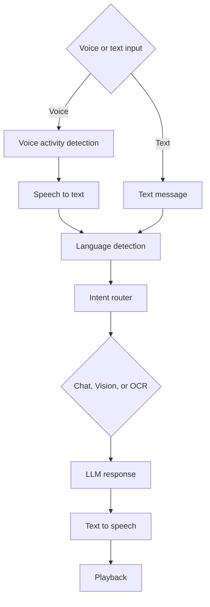

# TARZ

Local-first multimodal voice assistant built in Python.

## Features

- **Voice Activity Detection (VAD)**: Automatic endpoint detection - no need to press ENTER
- **Speech-to-Text**: Faster Whisper transcription with confidence-based verification for unreliable language detection
- **Multilingual Support**: English, Hindi/Hinglish, and Telugu/Telglish
- **Automatic Language Detection**: Detects language and script in real-time
- **Multi-modal Input**: Voice, text, and camera input support
- **Streaming Pipeline**: Real-time processing at every stage
- **Intelligent Routing**: Vision, OCR, or Chat mode based on intent

## Models And Configuration

The active defaults in `config.py` are:

| Component | Current setting | Available configuration options |
| --- | --- | --- |
| STT engine | Faster Whisper (`STT_MODEL = "whisper"`) | `whisper` is the implemented engine. `parakeet` is reserved as a configuration option but is not yet selected by `stt.py`. |
| Whisper model | `small` on `cpu` with `int8` compute | Model sizes: `tiny`, `base`, `small`, `medium`, `large`. Set `WHISPER_SIZE`, `WHISPER_DEVICE`, and `WHISPER_COMPUTE`. |
| LLM | Ollama `gemma3:4b` | Set `LLM_MODEL`. Install the selected model with Ollama first. |
| TTS | SuperTonic `M1` for English/Hindi; Piper Venkatesh for Telugu | Configure `TTS_LANGUAGE_BACKENDS` to select a backend and model per language. |
| Camera | OpenCV camera `0` | Set `CAMERA_INDEX`; use `CAPTURE_SAVE_IMAGES` and `CAPTURE_MAX_FILES` to control saved captures. |

Other useful options in `config.py`:

- **LLM output:** `LLM_MAX_TOKENS` is `1024`.
- **Languages:** English (`en`), Hindi (`hi`), and Telugu (`te`) are enabled. Set `DEFAULT_LANGUAGE` or `USER_PREFERRED_LANGUAGE`.
- **Audio and TTS:** `SAMPLE_RATE = 16000`, `TTS_SPEED = 0.92`, first-sentence streaming enabled, plus sentence-buffer and prefetch limits (`TTS_MIN_CHARS`, `TTS_MAX_CHARS`, `TTS_MIN_WORDS`, `TTS_MAX_WORDS`, `TTS_PREFETCH_TEXT`, `TTS_PREFETCH_AUDIO`). Add name pronunciations through `TTS_PRONUNCIATION_MAP`.
- **VAD:** Active endpoint settings are `VAD_SILENCE_THRESHOLD = 0.01`, `VAD_SILENCE_DURATION = 0.8`, `VAD_MIN_SPEECH_DURATION = 0.3`, `VAD_GRACE_PERIOD = 0.2`, and `VAD_MAX_RECORD_SECONDS = 30.0`.
- **STT decoding:** Tune `WHISPER_BEAM_SIZE = 5`, `WHISPER_LANGUAGE_CONFIDENCE_HIGH = 0.80`, fallback temperatures, quality thresholds, Hindi/Telugu decode prompts, and partial-transcript timing (`STT_MIN_PARTIAL_SECONDS`, `STT_PARTIAL_INTERVAL`, `STT_ROLLING_SECONDS`, `STT_OVERLAP_SECONDS`).
- **Camera:** `CAMERA_INDEX = 0`, saved captures are enabled, and `CAPTURE_MAX_FILES = 20` limits retained images.
- **Conversation behavior:** `MAX_HISTORY` controls retained turns; `ROUTER_CONFIDENCE_THRESHOLD` controls when the router asks for clarification.
- **Runtime switches:** `ENABLE_LIVE_TRANSCRIPT`, `ENABLE_PARTIAL_TRANSCRIPTS`, `MAX_PARTIAL_UPDATES_PER_SECOND`, and `DEBUG` control console behavior and diagnostic output.

## Installation

```bash
pip install -r requirements.txt
```

## Langfuse Tracing

Tarz records one Langfuse trace per conversation turn, grouped into a session.
Voice traces include `VAD`, `STT`, `Router`, `Memory`, `LLM`, `TTS`, and
`Playback` spans, plus a `Camera` tool span when requested. They capture VAD timing,
STT first-segment and completion latency, LLM time-to-first-token and token rate,
TTS synthesis timing, playback queue delay, and end-to-end latency. The root trace
also records session/conversation/request IDs, configured models, voice, and CPU/RAM
usage. It also includes startup time for Whisper and SuperTonic plus Ollama model
readiness; the first LLM request records `cold_start_ttft_ms` to expose inference
model-load cost. Camera frames and audio are never included in traces. Text sent to Langfuse
masks common email addresses and phone numbers.

Copy `.env.example` to `.env`, then add API keys from your Langfuse project:

```bash
LANGFUSE_PUBLIC_KEY=pk-lf-...
LANGFUSE_SECRET_KEY=sk-lf-...
LANGFUSE_BASE_URL=https://cloud.langfuse.com
```

Tracing is disabled until both keys are set. Use the appropriate Langfuse base URL
for your cloud region or self-hosted deployment.

## Voice Mode (VAD Enabled)

```
🎤 Listening... (Auto-stop on silence)
       🔊 Speaking (energy: 0.03)
       ✓ Endpoint detected

✓ Recorded: 2.34s
You: what's the weather
Language: English | Script: latin
```

**No keyboard input needed!** The system automatically stops recording after detecting 800ms of silence.

See [VAD_ENDPOINT_DETECTION.md](VAD_ENDPOINT_DETECTION.md) for detailed configuration and tuning.

## Architecture

- app.py
- config.py
- microphone.py (with VAD)
- stt.py (Faster Whisper transcription)
- router.py
- camera.py
- memory.py
- llm.py
- tts.py

No heavy framework. The application records an utterance, transcribes it, then streams the response to TTS.

## Runtime Pipeline



## Multilingual Behavior

- Detects conversation language (currently `en`, `hi`, `te`) and keeps responses in that language.
- Hindi in Devanagari stays Hindi end-to-end.
- Roman Hindi (Hinglish) is normalized to Devanagari before LLM.
- Telugu script and Roman Telugu (Telglish) are handled as Telugu; Telglish replies use Telugu script.
- No translation unless explicitly requested by the user.

### STT Language Verification

Voice input starts with one Faster Whisper auto-detect decode. This is the normal,
low-latency path. The result is accepted when the detected language is supported,
the language probability meets `WHISPER_LANGUAGE_CONFIDENCE_HIGH`, and the
transcript is clean and compatible with its detected script/language.

Only unreliable results are decoded again with forced `en`, `hi`, and `te`.
Candidates are ranked using language probability, native-script compatibility,
Roman English/Hindi/Telugu vocabulary, segment log probability, compression ratio,
and basic transcript-quality checks. The assistant returns one of Whisper's actual
transcripts; this verification never generates or rewrites user speech.

Retries are triggered by low confidence, an unsupported language, Arabic/Persian
script, a script-language mismatch, or empty/repeated-token output. This avoids
three decodes on normal requests.

## Language Resolution Policy

- Language and script are treated separately.
- Native Telugu and Devanagari scripts decide Telugu and Hindi respectively.
- Latin transcripts are scored using Roman Telugu, Roman Hindi, and clear English vocabularies; technical borrowed words do not influence the score.
- A supported, high-confidence Whisper result is used when transcript evidence is not decisive.
- Clear Latin input defaults to English, preventing prior language from becoming sticky.
- Previous conversation language is used only for ambiguous acknowledgements such as `ok` or `hmm`; user preference and then `en` are final fallbacks.
- Explicit user language switch commands override all heuristics.

### Example

- Input: `muje ek story batao`
- Dominant language: `hi`
- Normalized transcript: `मुझे एक स्टोरी बताओ`
- LLM + TTS language: Hindi

## TTS Preprocessing (TTS-Only)

- Original LLM response is not modified for memory/logging/display.
- A copy is preprocessed before TTS synthesis.
- Current preprocessing includes:
       - Number expansion by active conversation language (when `num2words` is available)
       - Punctuation smoothing to reduce unnatural pauses
       - Removal of sentence-ending punctuation after sentence buffering
       - Space normalization for smoother pacing

### Pacing Rules

- `, ; :` become wider pause spacing
- Brackets become whitespace
- Quotes are removed
- Repeated punctuation is collapsed
- Sentence-end punctuation is stripped before TTS

### Number Normalization

- Numbers are spoken in active conversation language (`en`, `hi`, `te`, and future configured languages).
- If `num2words` is unavailable, text falls back safely without number expansion.

## Camera Capture Retention

- Vision captures are saved in `captures/` by default.
- Old files are auto-pruned with rolling retention to avoid disk growth.
- Current retention is controlled by:
       - `CAPTURE_SAVE_IMAGES` in `config.py`
       - `CAPTURE_MAX_FILES` in `config.py`

## Run

```bash
python app.py
```


## Switch Modes

The application stays open when switching modes, so loaded models are reused.

- In text mode, enter `/menu` or `0` to return to the mode chooser.
- In voice mode, say `back to menu` to return to the mode chooser.
- At the chooser, select `1` for voice, `2` for text, or `0` to exit.