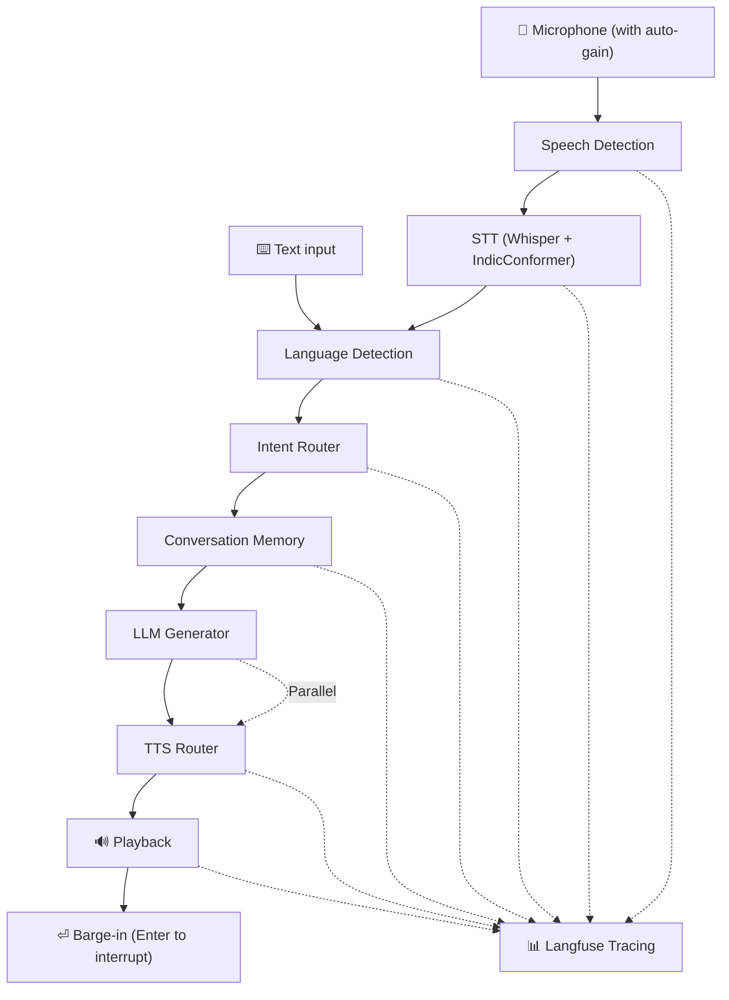

# TARZ

Local-first multilingual voice assistant built in Python.

## Highlights

- Voice-first interaction with automatic speech endpoint detection
- Faster-Whisper + optional IndicConformer for accurate multilingual STT
- Multilingual support: English, Hindi, Telugu, Malayalam, Arabic
- Handles Roman-script input: Hinglish, Telglish, Manglish, Arabizi
- Real-time pipeline: Microphone → STT → Language Detection → Router → Memory → LLM → TTS
- Dual TTS backends: SuperTonic (English, Hindi) and Piper (Telugu, Malayalam, Arabic)
- Context-aware filler sentences mask LLM latency
- Intent routing: Chat, Vision, OCR, System
- Task tracking for multi-turn conversations
- Barge-in interrupt: press Enter to stop speaking and ask new question
- Langfuse tracing for latency analysis
- Automatic microphone amplification for quiet devices

## Configuration

| Component | Default |
| --- | --- |
| STT | Whisper (small, CPU, int8) |
| STT (Indic) | IndicConformer for Hindi, Telugu, Malayalam |
| LLM | Gemma 3 (4B) |
| TTS | SuperTonic (English, Hindi) + Piper (Telugu, Malayalam, Arabic) |
| Languages | English, Hindi, Telugu, Malayalam, Arabic |
| Sample Rate | 16 kHz (mono) |
| Tracing | Langfuse (optional) |

## Installation

```bash
pip install -r requirements.txt
```

### Optional: IndicConformer (Hindi / Telugu / Malayalam)

IndicConformer provides higher-accuracy transcription for Indic languages when a language hint is available. It requires additional packages:

```bash
pip install onnxruntime torch indic-asr-onnx
```

Set `STT_INDIC_ASR_ENABLED = True` in `config.py` (already the default). Falls back to Whisper automatically if the package is not installed.

## Run

```bash
python app.py
```

## Runtime Pipeline


```

## Multilingual Behavior

- Language is detected on every turn using script detection, word recognition, and STT confidence
- Native scripts (Devanagari, Telugu, Malayalam, Arabic) are detected via Unicode ranges
- Roman-script input is identified using language-specific vocabulary banks (Hinglish, Telglish, Manglish, Arabizi)
- STT hint from Whisper probe takes priority in detection — prevents false detection when text is in multiple scripts
- Explicit language-switch commands override automatic detection
- LLM output is locked to the detected language for the turn

## Filler + Continuation

- Tarz speaks a short contextual filler sentence before responding to mask LLM generation latency
- Filler is selected based on intent category and language
- LLM generation starts in parallel while the filler is being spoken
- Response is streamed in sentence chunks for natural pacing

## Voice Mode Notes

- No key press required to stop recording — endpoint detection is automatic
- Press **Enter** while Tarz is speaking to interrupt playback and ask the next question
- Live partial transcripts are printed to console during recording (configurable via `ENABLE_PARTIAL_TRANSCRIPTS`)
- Automatic microphone gain: Quiet devices (amplitude < 0.01) are automatically amplified ~4x for reliable STT

## Langfuse Tracing

Set `LANGFUSE_PUBLIC_KEY` and `LANGFUSE_SECRET_KEY` in your environment to enable per-turn tracing.

Traces are recorded for each major pipeline stage: Speech Detection, STT, Language Detection, Intent Routing, Memory, LLM, and TTS.

```bash
LANGFUSE_PUBLIC_KEY=pk-lf-...
LANGFUSE_SECRET_KEY=sk-lf-...
LANGFUSE_BASE_URL=https://cloud.langfuse.com
```

## TTS Backends

| Language | Technology |
| --- | --- |
| English | SuperTonic |
| Hindi | SuperTonic |
| Telugu | Piper ONNX |
| Malayalam | Piper ONNX |
| Arabic | Piper ONNX |

## Project Files

| File | Purpose |
| --- | --- |
| `app.py` | Main orchestration loop, turn processing, barge-in |
| `config.py` | All runtime configuration (models, VAD, language, TTS, LLM) |
| `microphone.py` | Audio capture with energy-based VAD endpoint detection |
| `stt.py` | Faster-Whisper decode, hallucination filter, retry strategy, IndicConformer routing |
| `indic_stt.py` | IndicConformer ONNX streaming transcriber |
| `language.py` | Script detection, dominant-language classification, Hinglish normalization |
| `router.py` | Weighted semantic intent scoring (CHAT / VISION / OCR / SYSTEM) |
| `memory.py` | Per-session conversation history with configurable turn window |
| `llm.py` | Ollama prompt building, multimodal support, streaming sentence chunking |
| `tts.py` | SuperTonic synthesis with threaded playback workers |
| `piper_tts.py` | Piper ONNX synthesis bridge |
| `tts_router.py` | Per-language TTS backend selection with lazy Piper loading |
| `tracing.py` | Langfuse span/turn instrumentation |
| `camera.py` | OpenCV camera capture for vision and OCR turns |
| `audio_utils.py` | Audio helper utilities |
