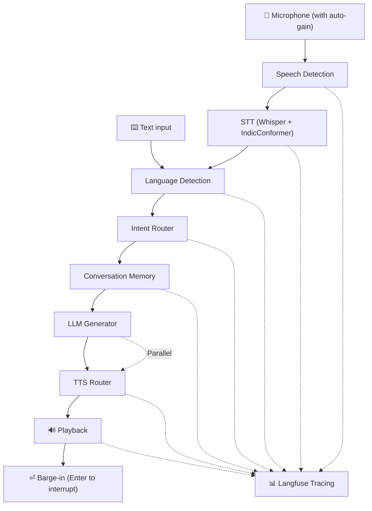

# TARZ

Local-first multilingual voice assistant built in Python.

## Highlights

- Voice-first interaction with automatic speech endpoint detection
- Faster-Whisper + optional IndicConformer for accurate multilingual STT
- Multilingual support: English, Hindi, Nepali, Telugu, Malayalam, Arabic
- Handles Roman-script input: Hinglish, Nepali (Roman), Telglish, Manglish, Arabizi
- Real-time pipeline: Microphone → STT → Language Detection → Router → Memory → LLM → TTS
- Dual TTS backends: SuperTonic (English, Hindi) and Piper (Nepali, Telugu, Malayalam, Arabic)
- Context-aware filler sentences mask LLM latency
- Intent routing: Chat, Vision, OCR, System
- Task tracking for multi-turn conversations
- Barge-in interrupt: press Enter to stop speaking and ask new question
- Langfuse tracing for latency analysis
- Automatic microphone amplification for quiet devices

## Defaults

| Component | Default |
| --- | --- |
| STT | Whisper (small, CPU, int8) |
| STT (Indic) | IndicConformer for Hindi, Telugu, Malayalam (Nepali uses Whisper path) |
| LLM | Gemma 3 (4B) |
| TTS | SuperTonic (English, Hindi) + Piper (Nepali, Telugu, Malayalam, Arabic) |
| Languages | English, Hindi, Nepali, Telugu, Malayalam, Arabic |
| Sample Rate | 16 kHz (mono) |
| Tracing | Langfuse (optional) |

## Installation

```bash
pip install -r requirements.txt
```

### Optional: IndicConformer (Hindi / Telugu / Malayalam)

IndicConformer provides higher-accuracy transcription for Indic languages when a language hint is available. It requires additional packages:

```bash
pip install onnxruntime torch indic-asr-onnx
```

Set `STT_INDIC_ASR_ENABLED = True` in `config/stt_config.py` (already the default). Falls back to Whisper automatically if the package is not installed.

Nepali currently runs through the Whisper multilingual path by default (better compatibility in this repo's current model set).

## Run

```bash
python app.py
```

## Smoke Test

Run a quick end-to-end configuration and language-routing sanity check (no microphone needed):

```bash
python tests/smoke_pipeline.py
```

## Runtime Pipeline



## Multilingual Behavior

- Language is detected on every turn using script detection, word recognition, and STT confidence
- Native scripts (Devanagari, Telugu, Malayalam, Arabic) are detected via Unicode ranges
- Roman-script input is identified using language-specific vocabulary banks (Hinglish, Nepali Roman, Telglish, Manglish, Arabizi)
- STT hint from Whisper probe takes priority in detection — prevents false detection when text is in multiple scripts
- Explicit language-switch commands override automatic detection
- LLM output is locked to the detected language for the turn

## Filler + Continuation

- Tarz speaks a short contextual filler sentence before responding to mask LLM generation latency
- Filler is selected based on intent category and language
- LLM generation starts in parallel while the filler is being spoken
- Response is streamed in sentence chunks for natural pacing

## Voice Mode Notes

- No key press required to stop recording — endpoint detection is automatic
- Press **Enter** while Tarz is speaking to interrupt playback and ask the next question
- Live partial transcripts are printed to console during recording (configurable via `ENABLE_PARTIAL_TRANSCRIPTS`)
- Automatic microphone gain: Quiet devices (amplitude < 0.01) are automatically amplified ~4x for reliable STT

## Langfuse Tracing

Set `LANGFUSE_PUBLIC_KEY` and `LANGFUSE_SECRET_KEY` in your environment to enable per-turn tracing.

Traces are recorded for each major pipeline stage: Speech Detection, STT, Language Detection, Intent Routing, Memory, LLM, and TTS.

```bash
LANGFUSE_PUBLIC_KEY=pk-lf-...
LANGFUSE_SECRET_KEY=sk-lf-...
LANGFUSE_BASE_URL=https://cloud.langfuse.com
```

## TTS Backends

| Language | Technology |
| --- | --- |
| English | SuperTonic |
| Hindi | SuperTonic |
| Nepali | Piper ONNX |
| Telugu | Piper ONNX |
| Malayalam | Piper ONNX |
| Arabic | Piper ONNX |

If a Piper model file is missing at runtime, Tarz now falls back to SuperTonic so the conversation continues instead of crashing. Add the matching Piper ONNX file to keep native-language voice output.

Current Nepali model path in config:

- models/piper/ne_NP-chitwan-medium.onnx

Hindi/Nepali disambiguation policy:

- Devanagari ambiguity defaults to Hindi unless Nepali-specific evidence is strong.
- Explicit language-switch commands still override auto-detection.

## Project Structure

```
Avatar_base/
├── app.py                      # Entry point — main orchestration loop, barge-in
├── config/
│   ├── __init__.py             # Re-exports all names (backward-compatible)
│   ├── llm_config.py           # LLM settings (model, tokens, history)
│   ├── stt_config.py           # Whisper settings, hotwords, streaming windows
│   ├── tts_config.py           # TTS chunking, prefaces, backends, pronunciation
│   ├── language_config.py      # Language detection, word banks, switch maps
│   ├── audio_config.py         # Sample rate, VAD thresholds
│   └── app_config.py           # Debug, camera, memory, router
├── core/
│   ├── language.py             # Script detection, dominant-language classification, Hinglish normalization
│   ├── memory.py               # Per-session conversation history
│   ├── router.py               # Weighted semantic intent scoring (CHAT / VISION / OCR / SYSTEM)
│   └── tracing.py              # Langfuse span/turn instrumentation
├── llm/
│   └── llm.py                  # Ollama prompt building, multimodal support, streaming sentence chunking
├── stt/
│   ├── stt.py                  # Faster-Whisper decode, hallucination filter, retry strategy
│   ├── indic_stt.py            # IndicConformer ONNX streaming transcriber
│   └── stt_livedecoding.py     # Live partial-transcript decoder
├── tts/
│   ├── tts.py                  # SuperTonic synthesis with threaded playback workers
│   ├── piper_tts.py            # Piper ONNX synthesis bridge
│   └── tts_router.py           # Per-language TTS backend selection with lazy Piper loading
├── audio/
│   ├── microphone.py           # Audio capture with energy-based VAD endpoint detection
│   └── audio_utils.py          # Audio helper utilities
├── camera/
│   └── camera.py               # OpenCV camera capture for vision and OCR turns
├── tests/                      # Standalone benchmarks and unit tests
├── models/piper/               # Piper ONNX voice models
└── captures/                   # Saved camera frames (auto-pruned)
```

## Configuration

All settings live in `config/` as [pydantic-settings](https://docs.pydantic.dev/latest/concepts/pydantic_settings/) classes. Every value can be overridden via a matching environment variable or the `.env` file:

```
LLM_MODEL=qwen2.5:3b
WHISPER_SIZE=medium
VOICE=M1
DEBUG=true
```

Layer files map 1-to-1 to pipeline concerns — edit only the file relevant to what you are tuning.
