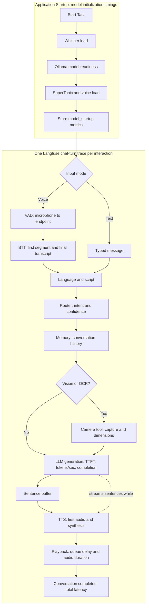

# TARZ

Local-first multimodal voice assistant built in Python.

## Features

- **Voice Activity Detection (VAD)**: Automatic endpoint detection - no need to press ENTER
- **Speech-to-Text**: Faster Whisper transcription after voice capture
- **Multilingual Support**: English, Hindi, and Hinglish (Roman Hindi)
- **Automatic Language Detection**: Detects language and script in real-time
- **Multi-modal Input**: Voice, text, and camera input support
- **Streaming Pipeline**: Real-time processing at every stage
- **Intelligent Routing**: Vision, OCR, or Chat mode based on intent

## Models And Configuration

The active defaults in `config.py` are:

| Component | Current setting | Available configuration options |
| --- | --- | --- |
| STT engine | Faster Whisper (`STT_MODEL = "whisper"`) | `whisper` is the implemented engine. `parakeet` is reserved as a configuration option but is not yet selected by `stt.py`. |
| Whisper model | `base` on `cpu` with `int8` compute | Model sizes: `tiny`, `base`, `small`, `medium`, `large`. Set `WHISPER_SIZE`, `WHISPER_DEVICE`, and `WHISPER_COMPUTE`. |
| LLM | Ollama `qwen2.5:1.5b` | Set `LLM_MODEL`. The configured alternatives are `gemma3:4b` and `gemma2:2b-instruct-q2_K`; install the selected model with Ollama first. |
| TTS | SuperTonic voice `M1` | Set `VOICE` to `M1`, `M2`, `F1`, `F2`, `F3`, `F4`, `F5`, or `F6`. |
| Camera | OpenCV camera `0` | Set `CAMERA_INDEX`; use `CAPTURE_SAVE_IMAGES` and `CAPTURE_MAX_FILES` to control saved captures. |

Other useful options in `config.py`:

- **LLM output:** `LLM_MAX_TOKENS` is `1024`.
- **Languages:** English (`en`) and Hindi (`hi`) are enabled. Set `DEFAULT_LANGUAGE` or `USER_PREFERRED_LANGUAGE`; uncomment additional entries in `SUPPORTED_LANGUAGES` only after confirming STT and TTS support.
- **Audio and TTS:** `SAMPLE_RATE = 16000`, `TTS_SPEED = 0.92`, plus sentence-buffer and prefetch limits (`TTS_MIN_CHARS`, `TTS_MAX_CHARS`, `TTS_MIN_WORDS`, `TTS_MAX_WORDS`, `TTS_PREFETCH_TEXT`, `TTS_PREFETCH_AUDIO`).
- **VAD:** Tune `VAD_SILENCE_THRESHOLD`, `VAD_SILENCE_DURATION`, `VAD_MIN_SPEECH_DURATION`, `VAD_GRACE_PERIOD`, and `VAD_MAX_RECORD_SECONDS`.
- **STT decoding:** Tune `WHISPER_BEAM_SIZE`, fallback temperatures, quality thresholds, and partial-transcript timing (`STT_MIN_PARTIAL_SECONDS`, `STT_PARTIAL_INTERVAL`, `STT_ROLLING_SECONDS`, `STT_OVERLAP_SECONDS`).
- **Conversation behavior:** `MAX_HISTORY` controls retained turns; `ROUTER_CONFIDENCE_THRESHOLD` controls when the router asks for clarification.
- **Runtime switches:** `ENABLE_LIVE_TRANSCRIPT`, `ENABLE_PARTIAL_TRANSCRIPTS`, `MAX_PARTIAL_UPDATES_PER_SECOND`, and `DEBUG` control console behavior and diagnostic output.

## Installation

```bash
pip install -r requirements.txt
```

## Langfuse Tracing

Tarz records one Langfuse trace per conversation turn, grouped into a session.
Voice traces include `VAD`, `STT`, `Router`, `Memory`, `LLM`, `TTS`, and
`Playback` spans, plus a `Camera` tool span when requested. They capture VAD timing,
STT first-segment and completion latency, LLM time-to-first-token and token rate,
TTS synthesis timing, playback queue delay, and end-to-end latency. The root trace
also records session/conversation/request IDs, configured models, voice, and CPU/RAM
usage. It also includes startup time for Whisper and SuperTonic plus Ollama model
readiness; the first LLM request records `cold_start_ttft_ms` to expose inference
model-load cost. Camera frames and audio are never included in traces. Text sent to Langfuse
masks common email addresses and phone numbers.

Copy `.env.example` to `.env`, then add API keys from your Langfuse project:

```bash
LANGFUSE_PUBLIC_KEY=pk-lf-...
LANGFUSE_SECRET_KEY=sk-lf-...
LANGFUSE_BASE_URL=https://cloud.langfuse.com
```

Tracing is disabled until both keys are set. Use the appropriate Langfuse base URL
for your cloud region or self-hosted deployment.

## Voice Mode (VAD Enabled)

```
🎤 Listening... (Auto-stop on silence)
       🔊 Speaking (energy: 0.03)
       ✓ Endpoint detected

✓ Recorded: 2.34s
You: what's the weather
Language: English | Script: latin
```

**No keyboard input needed!** The system automatically stops recording after detecting 800ms of silence.

See [VAD_ENDPOINT_DETECTION.md](VAD_ENDPOINT_DETECTION.md) for detailed configuration and tuning.

## Architecture

- app.py
- config.py
- microphone.py (with VAD)
- stt.py (Faster Whisper transcription)
- router.py
- camera.py
- memory.py
- llm.py
- tts.py

No heavy framework. The application records an utterance, transcribes it, then streams the response to TTS.

## Runtime And Tracing Flow



## Multilingual Behavior

- Detects conversation language (currently `en`, `hi`) and keeps responses in that language.
- Hindi in Devanagari stays Hindi end-to-end.
- Roman Hindi (Hinglish) is normalized to Devanagari before LLM.
- No translation unless explicitly requested by the user.

## Majority Language Policy

- Language and script are treated separately.
- Dominant conversation language is decided by majority of meaningful tokens.
- Detection excludes punctuation, numbers, named entities, and common technical mixed words.
- Tie-breaking order:
       - Previous conversation language
       - STT language hint
       - User preference (`USER_PREFERRED_LANGUAGE`)
       - Default (`en`)
- Explicit user language switch commands override all heuristics.

### Example

- Input: `muje ek story batao`
- Dominant language: `hi`
- Normalized transcript: `मुझे एक स्टोरी बताओ`
- LLM + TTS language: Hindi

## TTS Preprocessing (TTS-Only)

- Original LLM response is not modified for memory/logging/display.
- A copy is preprocessed before TTS synthesis.
- Current preprocessing includes:
       - Number expansion by active conversation language (when `num2words` is available)
       - Punctuation smoothing to reduce unnatural pauses
       - Removal of sentence-ending punctuation after sentence buffering
       - Space normalization for smoother pacing

### Pacing Rules

- `, ; :` become wider pause spacing
- Brackets become whitespace
- Quotes are removed
- Repeated punctuation is collapsed
- Sentence-end punctuation is stripped before TTS

### Number Normalization

- Numbers are spoken in active conversation language (`en`, `hi`, and future configured languages).
- If `num2words` is unavailable, text falls back safely without number expansion.

## Camera Capture Retention

- Vision captures are saved in `captures/` by default.
- Old files are auto-pruned with rolling retention to avoid disk growth.
- Current retention is controlled by:
       - `CAPTURE_SAVE_IMAGES` in `config.py`
       - `CAPTURE_MAX_FILES` in `config.py`

## Run

```bash
python app.py
```


