# TARZ

Local-first multilingual voice assistant built in Python.

## Highlights

- Voice-first interaction with automatic energy-based VAD endpoint detection
- Faster-Whisper STT with script/language verification, temperature fallback, and selective retry
- Optional IndicConformer (onnxruntime) routing for Hindi, Telugu, Malayalam
- Multilingual conversation: English, Hindi, Telugu, Malayalam, Arabic
- Roman-script input handling: Hinglish, Telglish, Manglish, Arabizi
- Per-language Whisper initial prompts, script prefixes, and hotwords for improved native-script accuracy
- Real-time streaming pipeline: Microphone → VAD → STT → Language → Router → Memory → LLM → TTS
- TTS router with lazy backend loading:
  - SuperTonic for English and Hindi
  - Piper for Telugu, Malayalam, and Arabic
- Context-aware latency-masking filler sentence spoken in parallel with LLM streaming
- Intent routing with weighted semantic scoring across Chat, Vision, OCR, and System intents
- Per-turn task tracking (story, joke, poem, travel, weather, math, coding, translation, camera)
- Terse follow-up detection with task-lock continuation for natural multi-turn conversations
- Per-turn language lock with continuity-focused LLM prompting
- Barge-in interrupt: press Enter while Tarz is speaking to stop and re-prompt
- Langfuse tracing for end-to-end turn and span telemetry

## Current Defaults (config.py)

| Component | Setting | Default |
| --- | --- | --- |
| STT engine | `STT_MODEL` | `whisper` |
| Whisper model size | `WHISPER_SIZE` | `small` (`cpu`, `int8`) |
| Whisper beam size | `WHISPER_BEAM_SIZE` | `1` |
| Whisper temperature fallback | `WHISPER_TEMPERATURES` | `(0.0, 0.2)` |
| IndicConformer routing | `STT_INDIC_ASR_ENABLED` | `True` (hi, te, ml) |
| LLM model | `LLM_MODEL` | `gemma3:4b` |
| LLM max tokens | `LLM_MAX_TOKENS` | `512` |
| Social-turn max tokens | `LLM_SOCIAL_MAX_TOKENS` | `96` |
| LLM warmup | `LLM_WARMUP_ON_STARTUP` | Enabled |
| LLM history mode | `LLM_HISTORY_MODE` | `full` |
| LLM history turns | `LLM_HISTORY_TURNS` | `6` |
| Max stored history messages | `MAX_HISTORY` | `10` turns |
| Voice | `VOICE` | `F2` |
| Sample rate | `SAMPLE_RATE` | `16000` Hz |
| VAD silence threshold | `VAD_SILENCE_THRESHOLD` | `0.015` RMS |
| VAD silence duration | `VAD_SILENCE_DURATION` | `0.5 s` |
| VAD max record | `VAD_MAX_RECORD_SECONDS` | `30 s` |
| Router confidence threshold | `ROUTER_CONFIDENCE_THRESHOLD` | `0.60` |
| Supported languages | `SUPPORTED_LANGUAGES` | `en`, `hi`, `te`, `ml`, `ar` |

## Installation

```bash
pip install -r requirements.txt
```

### Optional: IndicConformer (Hindi / Telugu / Malayalam)

IndicConformer provides higher-accuracy transcription for Indic languages when a language hint is available. It requires additional packages:

```bash
pip install onnxruntime torch indic-asr-onnx
```

Set `STT_INDIC_ASR_ENABLED = True` in `config.py` (already the default). Falls back to Whisper automatically if the package is not installed.

## Run

```bash
python app.py
```

## Runtime Pipeline

```mermaid
flowchart TD
    MIC["🎤 Microphone"]
    TXT["⌨️ Text input"]

    subgraph VAD_BLOCK["1 · Voice Activity Detection"]
        VAD_ENERGY["Energy-based VAD\nRMS endpoint detection"]
        VAD_SILERO["Silero VAD filter\naudio cleaning before transcription"]
    end

    subgraph STT_BLOCK["2 · Speech-to-Text"]
        INDIC_CHECK{"IndicConformer\nenabled & lang\nhint known?"}
        INDIC["IndicConformer\nhi · te · ml"]
        WHISPER["Faster-Whisper\nsmall · cpu · int8"]
        HALLUC["Hallucination filter\nknown-bad phrase check"]
        RETRY_CHECK{"Retry?\nlang mismatch /\nscript error /\nsuspicious text"}
        WHISPER2["Whisper re-decode\nforced lang + hotwords\n+ script prefix"]
        TRANSCRIPT["Transcript"]
    end

    subgraph LANG_BLOCK["3 · Language & Script Detection"]
        SCRIPT["detect_script\nUnicode range check"]
        LANGDET["detect_dominant_language\nword banks + STT hint\n+ previous turn language"]
        NORM["normalize_text\nHinglish token map + phrase map\nTelglish / Manglish / Arabizi"]
    end

    subgraph ROUTER_BLOCK["4 · Intent Router"]
        SCORE["Weighted semantic scoring\nphrase hits · noun hits · verb hits"]
        INTENT{"CHAT\nVISION\nOCR"}
    end

    subgraph CONTEXT_BLOCK["5 · Context & Memory"]
        TASK["Task detection\nstory · joke · poem · travel\nweather · math · coding · camera"]
        FOLLOWUP["Terse follow-up check\ntask-lock prompt build"]
        MEMORY["Conversation history\nfull or strict · N turns"]
        FILLER["Filler selection\ncategory + language aware"]
    end

    subgraph LLM_BLOCK["6 · LLM"]
        CAMERA["📷 Camera capture\nframe encode"]
        PROMPT["Prompt builder\nsocial wrap / task lock\n+ history injection"]
        STREAM["Ollama streaming\ngemma3:4b · sentence-chunked"]
    end

    subgraph TTS_BLOCK["7 · TTS Router"]
        TTS_ROUTE{"Language?"}
        SUPERTONIC["SuperTonic\nen · hi"]
        PIPER["Piper ONNX\nte · ml · ar\nlazy-loaded"]
        PRONOUNCE["Pronunciation map\nG2P corrections"]
    end

    subgraph OUTPUT_BLOCK["8 · Output"]
        PLAY["🔊 Playback"]
        BARGEIN["⏎ Barge-in\nEnter key stops speech"]
    end

    LANGFUSE[["📊 Langfuse\nper-turn + per-span tracing"]]

    %% ── Voice path ──────────────────────────────────────────────────────────
    MIC --> VAD_ENERGY
    VAD_ENERGY -->|"silence ≥ 0.5 s"| VAD_SILERO
    VAD_SILERO --> INDIC_CHECK

    %% ── STT branch ──────────────────────────────────────────────────────────
    INDIC_CHECK -->|"Yes"| INDIC
    INDIC_CHECK -->|"No"| WHISPER
    INDIC --> TRANSCRIPT
    WHISPER --> HALLUC
    HALLUC --> RETRY_CHECK
    RETRY_CHECK -->|"No retry"| TRANSCRIPT
    RETRY_CHECK -->|"Retry"| WHISPER2
    WHISPER2 --> TRANSCRIPT

    %% ── Text path joins here ────────────────────────────────────────────────
    TXT --> SCRIPT
    TRANSCRIPT --> SCRIPT

    %% ── Language & script ───────────────────────────────────────────────────
    SCRIPT --> LANGDET
    LANGDET --> NORM

    %% ── Router ──────────────────────────────────────────────────────────────
    NORM --> SCORE
    SCORE --> INTENT

    %% ── Context branch ──────────────────────────────────────────────────────
    INTENT -->|"CHAT"| TASK
    INTENT -->|"VISION / OCR"| CAMERA

    TASK --> FOLLOWUP
    FOLLOWUP --> MEMORY
    MEMORY --> FILLER

    %% ── LLM ─────────────────────────────────────────────────────────────────
    FILLER --> PROMPT
    CAMERA --> PROMPT
    PROMPT --> STREAM

    %% ── TTS ─────────────────────────────────────────────────────────────────
    STREAM --> TTS_ROUTE
    TTS_ROUTE -->|"en / hi"| SUPERTONIC
    TTS_ROUTE -->|"te / ml / ar"| PIPER
    SUPERTONIC --> PRONOUNCE
    PIPER --> PRONOUNCE
    PRONOUNCE --> PLAY
    PLAY --> BARGEIN

    %% ── Filler spoken in parallel while LLM generates ───────────────────────
    FILLER -.->|"parallel\nspeech"| TTS_ROUTE

    %% ── Tracing ─────────────────────────────────────────────────────────────
    VAD_SILERO -.-> LANGFUSE
    TRANSCRIPT -.-> LANGFUSE
    NORM -.-> LANGFUSE
    INTENT -.-> LANGFUSE
    MEMORY -.-> LANGFUSE
    STREAM -.-> LANGFUSE
    PLAY -.-> LANGFUSE
```



## Multilingual Behavior

- Language and script are resolved independently on every turn.
- Native-script input (Devanagari, Telugu, Malayalam, Arabic) is detected directly via Unicode range checks.
- Roman-script input is classified using per-language core-word banks (Hinglish, Telglish, Manglish, Arabizi) before falling back to English.
- Technical borrowed words (wifi, laptop, etc.) are excluded from language voting.
- Ambiguous short tokens (ok, yeah, hmm) inherit the previous turn's language.
- Explicit language-switch requests ("switch to Telugu") override in-turn detection.
- STT retry runs only on strong failure signals: unsupported language ID, script mismatch, hallucination match, or suspicious transcript patterns. Low-confidence-only retry is disabled by default (`STT_RETRY_ON_LOW_CONFIDENCE = False`).
- LLM output is hard-locked to the detected language for each turn.

## Intro/Filler + Continuation Policy

Tarz speaks a short contextual filler sentence before the LLM continuation to mask first-token latency.

- Filler is selected per intent category (greeting, wellbeing, story, joke, search, etc.) and per language.
- Filler is non-semantic: LLM is instructed to answer from the user message and history, not from what the filler said.
- LLM generation starts immediately while the filler is being spoken in parallel.
- Post-filler continuation is sentence-chunked for natural speech pacing.

## Voice Mode Notes

- No key press is required to stop recording — endpoint is declared automatically after configured silence.
- Press **Enter** while Tarz is speaking to interrupt playback and ask the next question.
- Live partial transcripts are printed to console during recording (configurable via `ENABLE_PARTIAL_TRANSCRIPTS`).

## Langfuse Tracing

Set `LANGFUSE_PUBLIC_KEY` and `LANGFUSE_SECRET_KEY` to enable one trace per turn.

Traced spans:

| Span | Contents |
| --- | --- |
| `VAD` | Microphone listen time, speech/silence durations |
| `STT` | Transcript, language hint, confidence, retry count |
| `Language` | Detected language, script, normalized message |
| `Router` | Selected intent, confidence score, routing reason |
| `Memory` | History message count |
| `LLM` | Prompt, model, streaming chunks, TTFT |
| `TTS` | Backend, language, synthesis latency |
| `Playback` | Audio duration |
| `Camera` | Frame capture latency (vision/OCR turns only) |

```bash
LANGFUSE_PUBLIC_KEY=pk-lf-...
LANGFUSE_SECRET_KEY=sk-lf-...
LANGFUSE_BASE_URL=https://cloud.langfuse.com
```

## TTS Backends

| Language | Backend | Model |
| --- | --- | --- |
| English (`en`) | SuperTonic | voice `F2` (configurable M1–M2, F1–F6) |
| Hindi (`hi`) | SuperTonic | voice `F2` |
| Telugu (`te`) | Piper | `models/piper/te_IN-maya-medium.onnx` |
| Malayalam (`ml`) | Piper | `models/piper/ml_IN-arjun-medium.onnx` |
| Arabic (`ar`) | Piper | `models/piper/ar_JO-kareem-medium.onnx` |

Piper backends are lazy-loaded on first use. `TTS_PRONUNCIATION_MAP` in `config.py` applies G2P corrections before synthesis (assistant name, AI terms, Telugu cluster fixes).

## Project Files

| File | Purpose |
| --- | --- |
| `app.py` | Main orchestration loop, turn processing, barge-in |
| `config.py` | All runtime configuration (models, VAD, language, TTS, LLM) |
| `microphone.py` | Audio capture with energy-based VAD endpoint detection |
| `stt.py` | Faster-Whisper decode, hallucination filter, retry strategy, IndicConformer routing |
| `indic_stt.py` | IndicConformer ONNX streaming transcriber |
| `language.py` | Script detection, dominant-language classification, Hinglish normalization |
| `router.py` | Weighted semantic intent scoring (CHAT / VISION / OCR / SYSTEM) |
| `memory.py` | Per-session conversation history with configurable turn window |
| `llm.py` | Ollama prompt building, multimodal support, streaming sentence chunking |
| `tts.py` | SuperTonic synthesis with threaded playback workers |
| `piper_tts.py` | Piper ONNX synthesis bridge |
| `tts_router.py` | Per-language TTS backend selection with lazy Piper loading |
| `tracing.py` | Langfuse span/turn instrumentation |
| `camera.py` | OpenCV camera capture for vision and OCR turns |
| `audio_utils.py` | Audio helper utilities |
